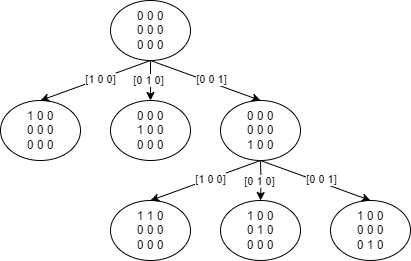
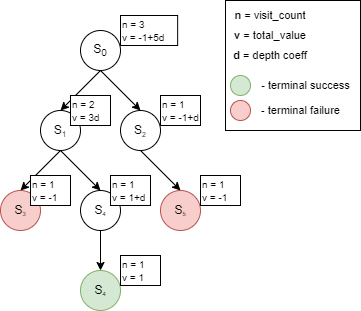
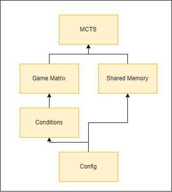

# H-matrix Search Using a Monte-Carlo-Tree-Search Based Algorithm

The ```makefile``` makes 2 executables:
- ```./search {path_to_output}```: requires 1 argument
- ```./test```: implements a self-made unittest framework to guarantee that the conditions for checking a matrix are implemented correctly

## Algorithm Description

### Configure Structure

Contains the hyperparameters of the algoirithms. These can be tuned to achieve different results:
- **N:** the number of columns
- **K:** the size of the original data word before encoding (used to find the number of rows)
- **rows:** N - K (make sure you set it yourself if you modify N or K)
- **max_weight:** the max weight of the considered columns
- **explore_coeff:** determines how willing are we to explore over to exploit duting the MCTS 
- **depth_coeff:** determines how valuable we consider going down one layer *(default: 1/K)*
- **num_searches:** the number of searches we perform on the tree
- **num_games:** the number of games we want to play starting from an empty state
- **enable_shared_memory:** enables the use of shared memory across games and iterations
- **enable_log_all_games:** enables logging the best state after each iteration
- **output_file:** path to the file where the results are written to

### General Description

The algorithm is based on a Monte-Carlo-Tree-Search. The MCTS is a search algorithm for some decision process. In our case we start with an empty matrix and we try to construct a matrix that does not violate any of our conditions. The decisions we are looking for are the the selection of columns that allows for the complete contrusction of our matrix.

### Tree Structure

The algorithm generates a tree in which each node is a matrix state and each edge corresponds to the column that was selected last. We call the selection of a column, *an action*. On the deepest level there will be only completed correct matrices.

The *action space* is given by the number of all possible columns we consider. For example, if we have 6 rows and take all 3-weight columns, ```action_count = 15```. It means that each node will have at most 15 children. The space of actions grows with the size of the matrix, and so do the number of children of each node.


*Fig. 1 Small example of matrix generation w. actions as edges and in-between matrices as states*

### MCTS Implementation

When a state is considered terminal (it violates one of the condition or completes the matrix) a value is given to the node and propagated up the path to the root. The algorithm uses a heuristic function which depends on how often a node was visited and the total value of the node to balance the exploration and exploitation of the search.


*Fig. 2 Example of how values and visits counts propagated from 3 terminal nodes*

Initially the tree starts only with the root node and generates all the other nodes. From the root we select one of its leaves (or the root itself initially), and generate all its children. We then simulate a random rollout of the state if they are not terminal states. The value of the rollout state we propagate upwards and so we generate the tree.

We differ from a normal MCTS implementation by adjusting our value propagation to take into account the depth of exploration. For each level we propagate upwards an addtion ```depth_coeff```, therefore the algorithm will have a higher incentive to explore states that more commonly lead to a terminal state.

### Dependencies


*Fig. 3 Dependecy graph*

- **Config:** the configuration of the algorithm
- **Conditions:** conditions that guarantee correct matrices
- **Game Matrix:** logic of manipulating the matrix state and action space
- **Shared Memory:** shared memory across iterations and games to store the best found matrix
- **MCTS:** tree implementation with nodes and the search procedure

